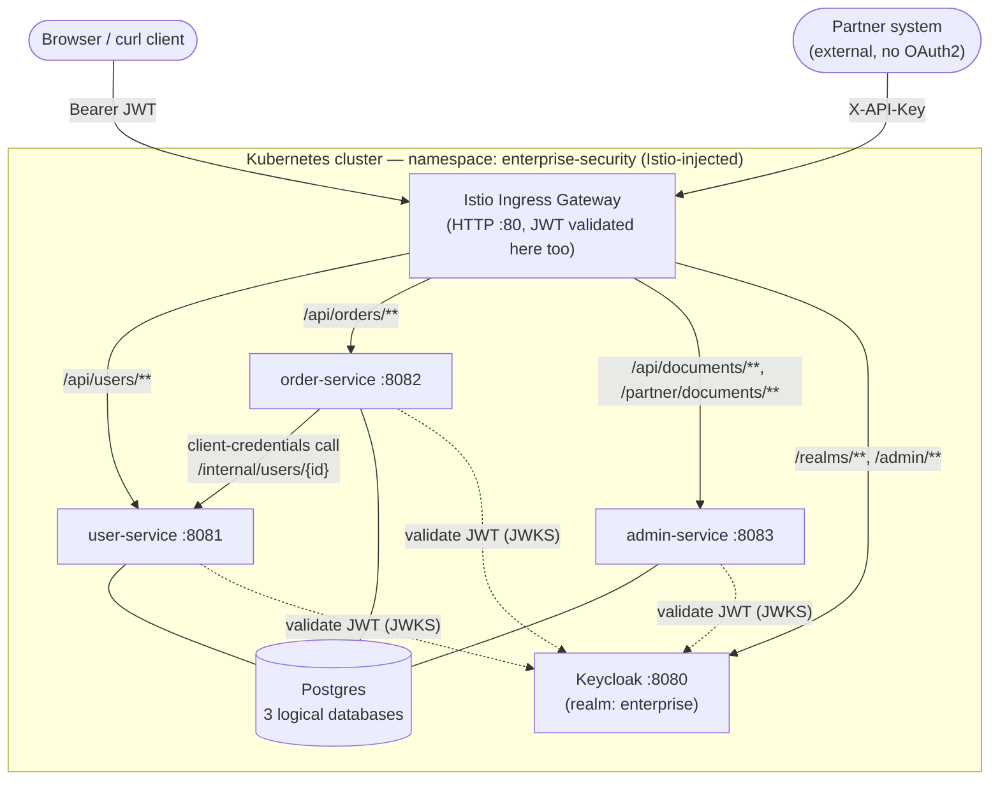
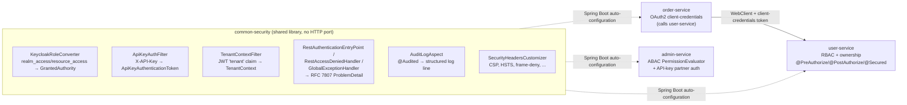

# Architecture Overview

[← Docs index](README.md)

This project is four independently-deployable Spring Boot services that share one library
(`common-security`) and lean on three pieces of off-the-shelf infrastructure — Keycloak, Istio,
and Kubernetes — for everything that isn't application-level authorization. The diagrams below
show how those pieces fit together, from the outside in.

## System context

Who and what talks to the system, and through which front door.

**What to notice:** the gateway has no route for `/internal/**` at all (see
[`k8s/istio/virtualservice.yaml`](../k8s/istio/virtualservice.yaml)) — that surface is reachable
only from inside the mesh, by `order-service`. Every service validates its own JWT against
Keycloak's JWKS endpoint independently; nothing trusts the gateway's validation alone (see
[04 · Security Layers](04-security-layers.md)).

## Container / module view

Inside the boundary, `common-security` is a shared auto-configuration library, not a service —
every box below except Keycloak and Postgres is a Spring Boot application built from this repo.

| Module | Role | Depends on |
|---|---|---|
| `common-security` | Shared auto-configuration: JWT role mapping, tenant propagation, API-key auth, RFC 7807 errors, audit logging aspect, security headers. | — |
| `user-service` | Owns `User`. RBAC + ownership checks; exposes `/internal/**` for service-to-service reads. | `common-security` |
| `order-service` | Owns `Order`. OAuth2 **client** (client-credentials) to call `user-service`; OAuth2 **resource server** for inbound calls. | `common-security` |
| `admin-service` | Owns `Document`. Custom `PermissionEvaluator` (RBAC + ABAC), multi-tenancy, API-key partner auth. | `common-security` |

Each service has its own database, port, and Kubernetes `Deployment`/`ServiceAccount` — there is
no shared database and no synchronous call other than `order-service → user-service`.

## Where to go next

- [02 · Request Flows](02-request-flows.md) — sequence diagrams for the flows implied by the
  arrows above
- [04 · Security Layers](04-security-layers.md) — why the same check (e.g. "is this
  `order-service`?") shows up at more than one layer
- [05 · Deployment](05-deployment.md) — how these boxes map onto pods, sidecars, and Kustomize overlays
