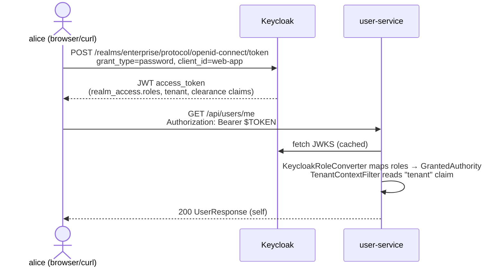
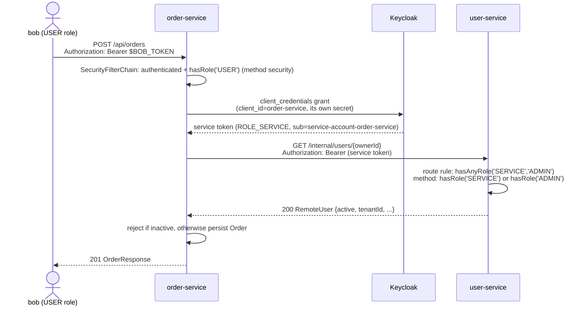
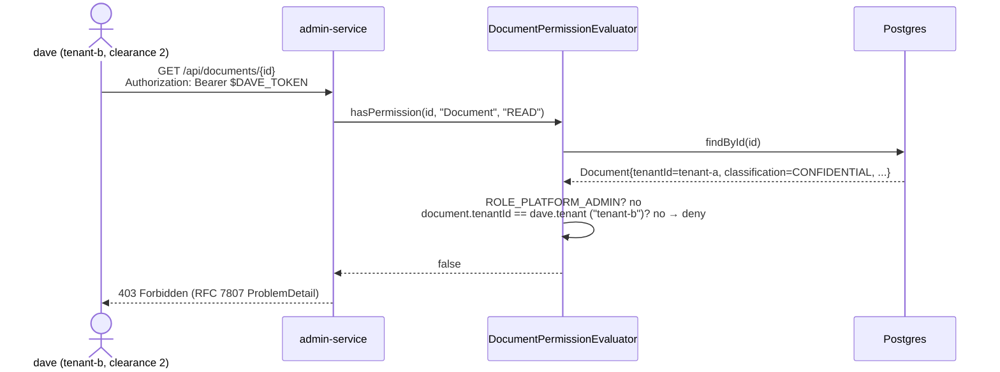
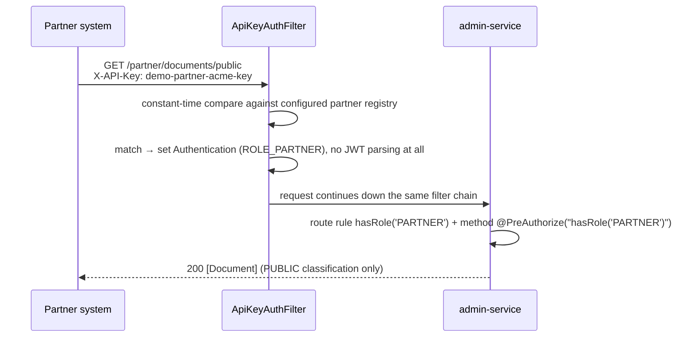

# Request Flows

[← Docs index](README.md)

Four flows that exercise every authentication mechanism in the project. Each diagram is a real,
runnable example — the curl commands are in the [root README](../README.md#example-requests).

## 1. User login → read your own profile (OIDC/JWT)

The most common path: a human gets a token from Keycloak, then calls a resource server directly.

**What to notice:** `getCurrentUser` needs no `@PreAuthorize` at all — it reads
`jwt.getSubject()` and looks up exactly that user, so there's no other user's data it could leak.

## 2. Cross-service call: create an order (client-credentials)

`order-service` never accepts `bob`'s token; it validates it as normal user traffic, then mints
its **own** token to call `user-service` — see
[`OAuth2ClientConfig`](../order-service/src/main/java/com/enterprise/security/orderservice/config/OAuth2ClientConfig.java)
and
[`UserServiceClient`](../order-service/src/main/java/com/enterprise/security/orderservice/client/UserServiceClient.java).

**What to notice:** three independent checks gate `/internal/users/{id}` — the route rule in
`user-service`'s `SecurityConfig`, the `@PreAuthorize` on
`getUserForServiceCall`, and (in the Kubernetes/Istio deployment) a mesh `AuthorizationPolicy`
that only lets `order-service`'s SPIFFE identity reach that path at all. See
[04 · Security Layers](04-security-layers.md).

## 3. ABAC document access (tenant + clearance, ahead of role)

`admin-service`'s `DocumentPermissionEvaluator` runs *before* the method body, as part of the
`@PreAuthorize("hasPermission(#id, 'Document', 'READ')")` SpEL expression.

If dave instead requested a **tenant-b** document classified `RESTRICTED` while his own
`clearance` claim is `2`, the tenant check would pass but the clearance check
(`clearance < classification.ordinal()`) would still deny it — two independent ABAC conditions,
both enforced before any role is even considered. `ROLE_PLATFORM_ADMIN` is the one deliberate
escape hatch that skips both checks.

## 4. Partner integration (API key, no JWT at all)

Models a legacy/B2B caller that can't do OAuth2.

**What to notice:** `ApiKeyAuthFilter` only acts when the `X-API-Key` header is present, so JWT
bearer-token requests on the same service are completely unaffected — the two schemes coexist on
one filter chain (`admin-service`'s `SecurityConfig`).
