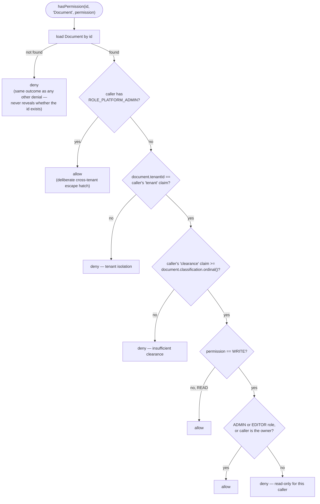

# Authorization Model

[← Docs index](README.md)

Authentication answers "who is this?" — Keycloak's job. Everything below is **authorization**:
"can *this* caller do *this* thing to *this* resource?" — Spring Security's job, and the part this
repo is really about.

## RBAC vs ABAC, in one project

- **Role-based (RBAC)** — a caller's roles alone decide the outcome. Fast, easy to reason about,
  used wherever "any ADMIN can do this" is actually true.
- **Attribute-based (ABAC)** — the outcome depends on *comparing* attributes of the caller (tenant,
  clearance) against attributes of the resource (tenant, classification). Used exactly once, in
  `admin-service`, because it's the one resource (`Document`) where role alone isn't enough — a
  tenant-a `ADMIN` must never read a tenant-b document, clearance or no.

Both coexist deliberately: RBAC everywhere it's sufficient, ABAC layered on top only where a role
check would be wrong.

## The three method-security annotations, side by side

The project uses all three on purpose, to show the different shapes of the same underlying
mechanism (`@EnableMethodSecurity` in
[`CommonSecurityAutoConfiguration`](../common-security/src/main/java/com/enterprise/security/common/config/CommonSecurityAutoConfiguration.java)):

| Annotation | Evaluated | Example | Why this shape here |
|---|---|---|---|
| `@Secured` | Before the call, roles only, no SpEL | `UserService.listUsersInCurrentTenant`: `@Secured({"ROLE_ADMIN","ROLE_SUPPORT"})` | Simplest possible gate — a fixed set of roles, nothing to compute |
| `@PreAuthorize` | Before the call, full SpEL over arguments | `UserService.updateUser`: `@PreAuthorize("hasRole('ADMIN') or #id == authentication.name")` | Needs a method argument (`#id`) to express ownership |
| `@PostAuthorize` | After the call, full SpEL over the **return value** | `UserService.getUser`: `@PostAuthorize("hasRole('ADMIN') or hasRole('SUPPORT') or returnObject.id == authentication.name or returnObject.tenantId == authentication.token.claims['tenant']")` | The resource has to be *loaded* before its tenant is known — there's no argument to check ahead of time |

`@PreAuthorize("hasPermission(#id, 'Document', 'READ')")` (used throughout `DocumentService`) is a
fourth shape in practice: it still runs before the call, but delegates the actual decision to a
custom `PermissionEvaluator` instead of inline SpEL — see below.

## ABAC decision flow: `DocumentPermissionEvaluator`

Every branch that isn't the platform-admin escape hatch returns `false` rather than distinguishing
"not found" from "not allowed" — that's deliberate: a 403 for a real document in another tenant
and a 403 for a document that doesn't exist look identical, so the caller can't use the API to
probe which document IDs are real.

## Role / permission matrix

The five seeded users (`keycloak/realm-export.json`) exercise every branch above:

| User | Realm roles | Tenant | Clearance | Can do |
|---|---|---|---|---|
| **alice** | ADMIN, USER | tenant-a | 3 | Full RBAC admin actions in tenant-a; ABAC still applies to documents outside tenant-a |
| **bob** | USER | tenant-a | 1 | Self-service only: own profile, own orders; low clearance blocks high-classification tenant-a documents |
| **carol** | SUPPORT, USER | tenant-a | 2 | Read-only oversight: list users/orders/documents in tenant-a, cannot write documents |
| **dave** | EDITOR, USER | tenant-b | 2 | Create/edit tenant-b documents up to `CONFIDENTIAL`; **403** on any tenant-a document regardless of role |
| **root-admin** | PLATFORM_ADMIN, ADMIN, USER | tenant-a | 3 | Only identity that can read/write documents **across tenants** (the one escape hatch) |

`service-account-order-service` (not a human user) carries `SERVICE`, used solely for the
client-credentials call described in [02 · Request Flows](02-request-flows.md#2-cross-service-call-create-an-order-client-credentials).
The `PARTNER` authority is never issued by Keycloak at all — it's granted directly by
`ApiKeyAuthFilter` to whoever presents a valid `X-API-Key` (see
[`admin-service/application.yml`](../admin-service/src/main/resources/application.yml)).

## Layering, at a glance

Route rule (`SecurityConfig`) → method security (`@PreAuthorize`/`@PostAuthorize`/`@Secured`) →
`PermissionEvaluator` (ABAC, `admin-service` only). Each layer is coarser than the last and fails
closed independently — see [04 · Security Layers](04-security-layers.md) for how this composes
with the *mesh*-level checks Istio adds outside the JVM entirely.
