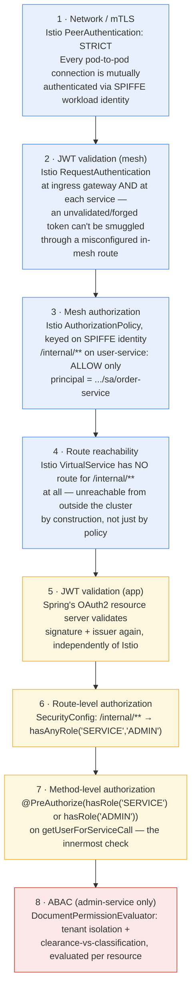

# Security Layers (Defense in Depth)

[← Docs index](README.md)

The clearest way to see this project's design is to follow one request — `order-service` calling
`user-service`'s `/internal/users/{id}` — through every layer that has to agree before it
succeeds. No single layer is trusted alone; each is independently sufficient to stop an attacker,
so a bug or misconfiguration in one doesn't expose the resource.

Blue = mesh/infrastructure layers (Istio, outside the JVM). Yellow = Spring Security layers
(inside the JVM, this repo's code). Red = ABAC, `admin-service`'s extra layer for one specific
resource type.

## Why duplicate the JWT and identity checks?

It looks redundant that both Istio (layers 1–4) and Spring Security (layers 5–7) validate the
same token and the same "is this really `order-service`?" question. That's the point:

- If Istio's mTLS/AuthorizationPolicy were ever misconfigured or bypassed (e.g. a debug port
  opened, a policy typo), the Spring Security layers still reject the request on their own.
- If a bug in `user-service`'s Spring config ever accidentally widened `/internal/**` to
  `permitAll()`, the mesh `AuthorizationPolicy` still blocks every caller except
  `order-service`'s own workload identity — and the ingress `VirtualService` blocks every caller
  from *outside* the cluster regardless.

A single compromised or misconfigured layer is never enough on its own.

## Layer-by-layer reference

| # | Layer | Enforced by | File |
|---|---|---|---|
| 1 | mTLS | Istio `PeerAuthentication` (STRICT) | [`k8s/istio/peer-authentication.yaml`](../k8s/istio/peer-authentication.yaml) |
| 2 | JWT validation (mesh) | Istio `RequestAuthentication` (gateway + namespace-wide) | [`k8s/istio/request-authentication.yaml`](../k8s/istio/request-authentication.yaml) |
| 3 | Mesh authorization | Istio `AuthorizationPolicy` per service | [`k8s/istio/authorization-policy-user-service.yaml`](../k8s/istio/authorization-policy-user-service.yaml) |
| 4 | Route reachability | Istio `VirtualService` (no route = unreachable) | [`k8s/istio/virtualservice.yaml`](../k8s/istio/virtualservice.yaml) |
| 5 | JWT validation (app) | Spring OAuth2 resource server | `SecurityConfig` in each service |
| 6 | Route-level authorization | `authorizeHttpRequests(...)` | `SecurityConfig` in each service |
| 7 | Method-level authorization | `@PreAuthorize`/`@PostAuthorize`/`@Secured` | service classes (see [03 · Authorization Model](03-authorization-model.md)) |
| 8 | ABAC | Custom `PermissionEvaluator` | [`DocumentPermissionEvaluator`](../admin-service/src/main/java/com/enterprise/security/adminservice/security/DocumentPermissionEvaluator.java) |

Layers 1–4 only exist in the Kubernetes/Istio deployment (see
[05 · Deployment](05-deployment.md)) — the Docker Compose path skips them entirely and relies on
layers 5–8 alone, which is exactly why the README frames Compose as being for *iterating on the
application-level security* specifically.

## Cross-cutting, at every layer

- **Consistent errors**: every 401/403, whatever layer produced it, ends up as an RFC 7807
  `ProblemDetail` (`RestAuthenticationEntryPoint`, `RestAccessDeniedHandler`,
  `GlobalExceptionHandler`) — a caller can't tell which layer rejected them from the response
  shape alone.
- **Audit logging**: every state-changing method carrying `@Audited`
  (`AuditLogAspect`) writes a structured log line — principal, tenant, action, outcome — regardless
  of which authorization layer let the call through.
- **Hardened headers**: `SecurityHeadersCustomizer` applies CSP, HSTS, frame-deny, and a
  restrictive permissions-policy to every response from every service.
