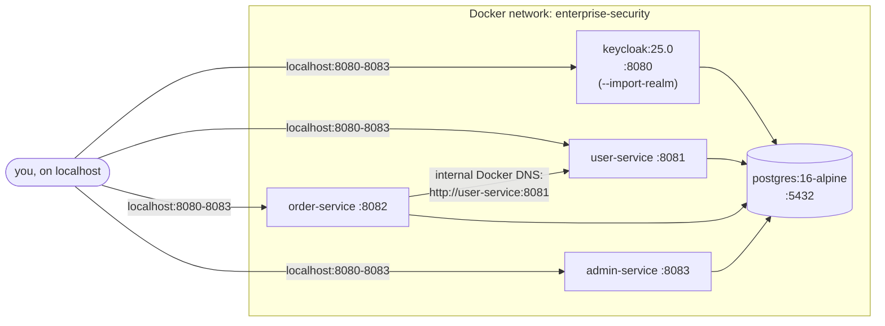
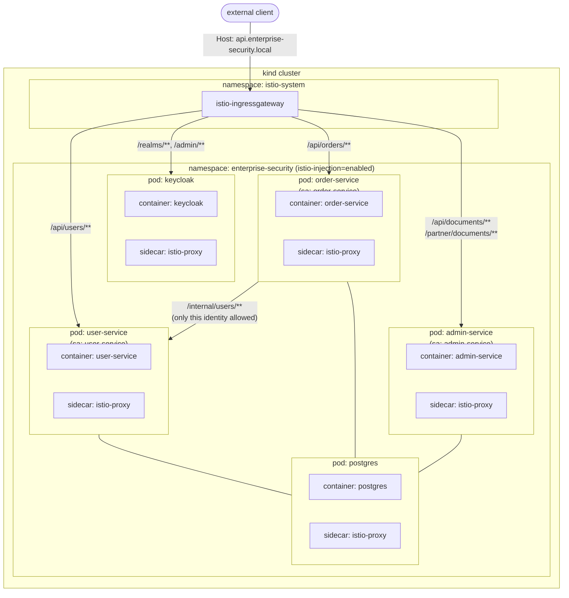
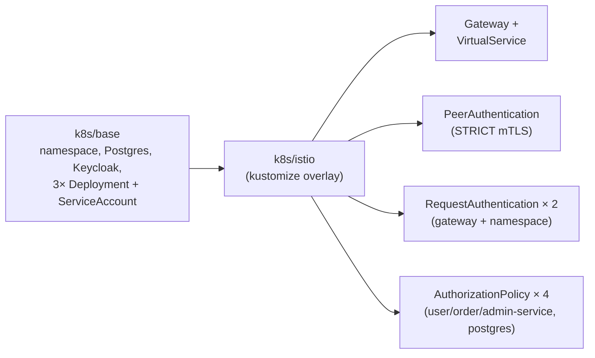

# Deployment

[← Docs index](README.md)

Two ways to run this project, matching the two directories that define them:
[`docker-compose.yml`](../docker-compose.yml) for fast local iteration, and
[`k8s/`](../k8s) for the production-shaped deployment. Full step-by-step commands are in the
[root README](../README.md#running-it) — this page is the map, not the manual.

## Option A — Docker Compose (no mesh)

One Postgres instance, three logical databases (`user_service`, `order_service`,
`admin_service`), seeded by [`db/postgres-init.sql`](../db/postgres-init.sql). No Istio, no mTLS,
no mesh-level authorization — only layers 5–8 from
[04 · Security Layers](04-security-layers.md) are active. Good for iterating on JWT roles, method
security, ABAC, and API keys without a cluster.

## Option B — Kubernetes + Istio (production-shaped)

Every pod runs `2/2` containers: the app plus the Istio sidecar that terminates mTLS and enforces
`AuthorizationPolicy`. `k8s/istio/kustomization.yaml` layers the Istio resources
(`Gateway`, `VirtualService`, `PeerAuthentication`, `RequestAuthentication`,
`AuthorizationPolicy` × 4) on top of `k8s/base` (namespace, Postgres, Keycloak, the three
services — each with its own `Deployment` and `ServiceAccount`).

## Ports (Compose / port-forward from cluster)

| Service | Port |
|---|---|
| Keycloak | 8080 |
| user-service | 8081 |
| order-service | 8082 |
| admin-service | 8083 |
| Postgres | 5432 (Compose only) |

## Known simplifications

Carried over from the root README, called out rather than hidden: `ddl-auto: update` instead of
migrations, plaintext demo credentials in Secrets/ConfigMaps, the `web-app` client's
Resource-Owner-Password flow enabled purely for demo `curl` logins, an HTTP-only Istio `Gateway`
(no TLS termination), and manifests that were reviewed and validated as syntactically correct but
not applied against a live cluster in the environment this was built in.
