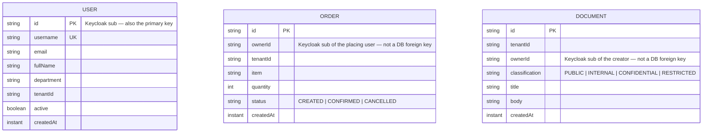

# Data Model

[← Docs index](README.md)

Four physically separate databases (`user_service`, `order_service`, `admin_service`, `keycloak`
— see [`db/postgres-init.sql`](../db/postgres-init.sql)), one owning user each, one JPA entity
each. There is no shared schema and no foreign key crosses a service boundary — `Order.ownerId`
and `Document.ownerId` are Keycloak subjects (`sub` claims), resolved by calling the owning
service, never joined in SQL.

(No relationship lines: `USER`, `ORDER`, and `DOCUMENT` live in three different databases owned
by three different services — the only connection between them is `ownerId`/`tenantId` string
values, resolved cross-service over HTTP, never a database join.)

## Notes

- **`User.id`** is the Keycloak subject directly, "so ownership checks can compare the path
  variable directly against `authentication.name` without a separate identity-mapping lookup" —
  see the class Javadoc in
  [`User.java`](../user-service/src/main/java/com/enterprise/security/userservice/domain/User.java).
- **`Classification`**'s enum ordinal *is* the required clearance level (`PUBLIC=0` …
  `RESTRICTED=3`), compared directly against the caller's `clearance` JWT claim in
  `DocumentPermissionEvaluator` — see [03 · Authorization Model](03-authorization-model.md).
- **`tenantId`** appears on all three entities and is the ABAC/multi-tenancy boundary enforced in
  `admin-service`, and the RBAC scoping key (`TenantContext`) used by the `listXInCurrentTenant()`
  queries in `user-service` and `order-service`.
- Every service uses `ddl-auto: update` (a demo-only convenience — see
  [05 · Deployment](05-deployment.md#known-simplifications)) instead of Flyway/Liquibase
  migrations.
