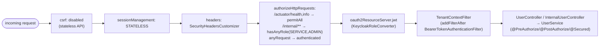
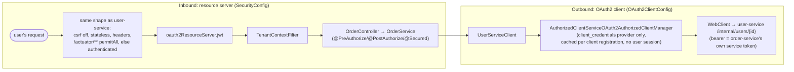
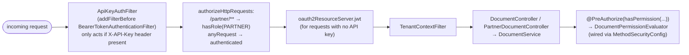

# Module Reference

[← Docs index](README.md)

How `common-security`'s beans compose into each service's `SecurityFilterChain`. High-level
component wiring, not exhaustive Javadoc — follow the file links for the real source.

## `common-security`: what it exposes

A Spring Boot `@AutoConfiguration` (
[`CommonSecurityAutoConfiguration`](../common-security/src/main/java/com/enterprise/security/common/config/CommonSecurityAutoConfiguration.java)),
picked up automatically by every service that depends on the module — no explicit `@Import` needed.

| Bean | Purpose |
|---|---|
| `KeycloakRoleConverter` | Maps `realm_access.roles` + `resource_access.<client>.roles` to `ROLE_*` `GrantedAuthority`s |
| `RestAuthenticationEntryPoint` / `RestAccessDeniedHandler` | 401/403 → RFC 7807 `ProblemDetail`, at the filter-chain level |
| `TenantContextFilter` | Reads the JWT `tenant` claim into a request-scoped `TenantContext` |
| `ApiKeyAuthFilter` | Authenticates `X-API-Key` requests against a configured partner registry |
| `AuditLogAspect` | `@Around("@annotation(audited)")` — one structured log line per `@Audited` method |
| `GlobalExceptionHandler` | Same RFC 7807 shape for exceptions thrown *inside* controllers |
| `@EnableMethodSecurity(prePostEnabled, securedEnabled)` | Turns on `@PreAuthorize`/`@PostAuthorize`/`@Secured` for every consuming service |

`SecurityHeadersCustomizer` is a plain static helper (not a bean) that each service's
`SecurityConfig` applies explicitly via `.headers(SecurityHeadersCustomizer.apiDefaults())`.

## `user-service`: filter chain composition

Pure resource server: every request needs a valid JWT. Route rules are coarse (which paths need
which role); the fine-grained ownership/tenant logic lives in `UserService`'s method annotations
(see [03 · Authorization Model](03-authorization-model.md)).

## `order-service`: two roles on one process

The two concerns don't overlap on the same filter chain: `SecurityConfig` governs requests
*arriving* at `order-service`; `OAuth2ClientConfig` + `UserServiceClient` govern the call
`order-service` *makes* to `user-service`.

## `admin-service`: two credential types, one filter chain

`MethodSecurityConfig` registers a `static @Bean MethodSecurityExpressionHandler` — static
deliberately, per Spring Security's own guidance, because method interceptors are constructed very
early as `BeanPostProcessor`s and a non-static bean method here triggers a
"bean currently in creation" cycle at startup.

## Source map

| Concern | File |
|---|---|
| Shared auto-configuration | [`CommonSecurityAutoConfiguration`](../common-security/src/main/java/com/enterprise/security/common/config/CommonSecurityAutoConfiguration.java) |
| JWT → authorities | [`KeycloakRoleConverter`](../common-security/src/main/java/com/enterprise/security/common/jwt/KeycloakRoleConverter.java) |
| API-key auth | [`ApiKeyAuthFilter`](../common-security/src/main/java/com/enterprise/security/common/apikey/ApiKeyAuthFilter.java) |
| Tenant propagation | [`TenantContextFilter`](../common-security/src/main/java/com/enterprise/security/common/tenant/TenantContextFilter.java) |
| Audit logging | [`AuditLogAspect`](../common-security/src/main/java/com/enterprise/security/common/audit/AuditLogAspect.java) |
| `user-service` filter chain | [`SecurityConfig`](../user-service/src/main/java/com/enterprise/security/userservice/config/SecurityConfig.java) |
| `order-service` filter chain | [`SecurityConfig`](../order-service/src/main/java/com/enterprise/security/orderservice/config/SecurityConfig.java) |
| `order-service` OAuth2 client | [`OAuth2ClientConfig`](../order-service/src/main/java/com/enterprise/security/orderservice/config/OAuth2ClientConfig.java) |
| `admin-service` filter chain | [`SecurityConfig`](../admin-service/src/main/java/com/enterprise/security/adminservice/config/SecurityConfig.java) |
| ABAC evaluator | [`DocumentPermissionEvaluator`](../admin-service/src/main/java/com/enterprise/security/adminservice/security/DocumentPermissionEvaluator.java) |
